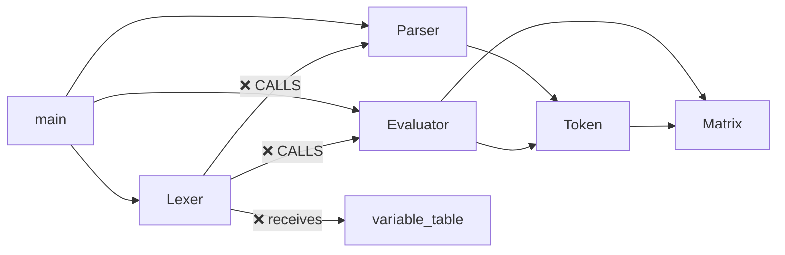

# Calculator Engine — Architecture Analysis & Refinement Suggestions

## Current Architecture Overview



The processing pipeline is conceptually **Lexer → Parser → Evaluator**, but the current implementation breaks this clean layering in several places.

---

## 🔴 Critical Issues

### 1. Circular Dependency: Lexer → Parser → Evaluator

**Files:** [Lexer.cpp](file:///home/kerem/Desktop/dev/calculator-engine/src/Lexer.cpp#L126-L167)

The [tokenizeMatrix](file:///home/kerem/Desktop/dev/calculator-engine/src/Lexer.cpp#126-168) method calls `Parser::ToPostfix` and `Evaluator::Evaluate` to resolve each cell's expression inline during tokenization:

```cpp
// Lexer.cpp:135-138 — cell parsing inside the lexer
auto tokens = Tokenize(input.substr(start, cursor - start), variables);
std::vector<Token> post = Parser::ToPostfix(tokens);
data[row].push_back(std::get<double>(Evaluator::Evaluate(post, variables).data));
```

This happens **3 separate times** (lines 135-138, 152-154, 163-165).

**Problems:**
- **Violates layered architecture.** The Lexer should not know the Parser or Evaluator exist. The dependency should be strictly one-directional: `main → Lexer → Parser → Evaluator`.
- **Prevents reuse.** You can't use the Lexer without also linking the Parser and Evaluator.
- **Makes testing hard.** Unit-testing the Lexer requires the entire pipeline.
- **Limits composability.** If you ever want a different evaluator backend (e.g., symbolic), the Lexer is hardcoded to the current one.

**Suggested fix — "Lazy Matrix Token":**

Instead of eagerly evaluating each cell, the Lexer should emit a *raw* matrix token that contains the **unparsed cell strings**. The actual parsing and evaluation of those cells would be deferred to a later stage (either a dedicated resolution pass between Lexer and Parser, or integrated into the Evaluator).

```
// Pseudocode: Lexer only extracts raw text
struct RawMatrix {
    std::vector<std::vector<std::string>> cells;  // e.g. {{"2^2", "cos(0)"}, {"1", "3+1"}}
};

// A new resolution phase (or the Evaluator) handles:
//   for each cell: Lexer::Tokenize → Parser::ToPostfix → Evaluator::Evaluate
```

This completely eliminates the circular dependency. The Lexer becomes a pure tokenizer again.

---

### 2. Variable Table Leaking into the Lexer

**Files:** [Lexer.hpp:40](file:///home/kerem/Desktop/dev/calculator-engine/src/Lexer.hpp#L40), [Lexer.cpp:13](file:///home/kerem/Desktop/dev/calculator-engine/src/Lexer.cpp#L13)

The Lexer's public API requires a `std::unordered_map<std::string, Value>&`:

```cpp
static std::vector<Token> Tokenize(std::string_view, std::unordered_map<std::string, Value>&);
```

**Problems:**
- A lexer should be a pure `string → tokens` function. It has no business knowing about runtime variable values.
- The only reason it receives the variable table is to forward it to `Evaluator::Evaluate` inside [tokenizeMatrix](file:///home/kerem/Desktop/dev/calculator-engine/src/Lexer.cpp#126-168) — which itself shouldn't be happening (see issue #1).

**Suggested fix:** Once the matrix tokenization is refactored (issue #1), the variable table parameter is completely removed from the Lexer. The signature becomes:

```cpp
static std::vector<Token> Tokenize(std::string_view input);
```

---

## 🟡 Design Improvements

### 3. Token Struct Is Overloaded with Responsibilities

**File:** [Token.hpp](file:///home/kerem/Desktop/dev/calculator-engine/src/Token.hpp)

The [Token](file:///home/kerem/Desktop/dev/calculator-engine/src/Token.hpp#114-118) struct serves **three** roles simultaneously:
1. **Lexer output** (type + raw value)
2. **Parser output** (retains `argc` for variadic functions)
3. **Evaluator operand/result** (carries evaluated `Value`)

It also carries `variable_name` for variable tokens and `argc` for function arity.

**Problems:**
- A 242-line struct is doing too much. Adding a new feature means modifying [Token](file:///home/kerem/Desktop/dev/calculator-engine/src/Token.hpp#114-118) no matter what layer it belongs to.
- The [toString()](file:///home/kerem/Desktop/dev/calculator-engine/src/Token.hpp#131-236) method is a 100-line switch — this is a maintenance burden and a frequent source of merge conflicts.

**Suggestions:**
- **Short-term:** Extract [toString()](file:///home/kerem/Desktop/dev/calculator-engine/src/Token.hpp#131-236) into a free function or a dedicated formatter (you already have [PrettyPrint](file:///home/kerem/Desktop/dev/calculator-engine/src/PrettyPrint.h#21-31) — consolidate).
- **Long-term:** Consider splitting into **LexerToken** (type + span/position) and **ASTNode** (carries semantic info like argc, value). The parser would consume `LexerToken`s and produce `ASTNode`s. This is a larger refactor, but it eliminates the impedance mismatch between lexing and evaluation.

---

### 4. Bitmask Enum (`TokenType`) Is Fragile at Scale

**File:** [Token.hpp:11-43](file:///home/kerem/Desktop/dev/calculator-engine/src/Token.hpp#L11-L43)

Using `uint64_t` bit-shifts gives you fast bitmask operations (`token.type & MathFunctions`), which is clever for the current set of ~30 tokens. However:

- **You're already at bit 30** (`Var = 1ULL << 30`). You have headroom up to 63, but this will become a concern as you add more features.
- The bitmask categories on lines 48-54 use `uint32_t`, which can only hold bits 0-31. Once you exceed bit 31, these constexpr masks will silently truncate:

```cpp
constexpr uint32_t MathFunctions = Sin | Cos | ...; // ⚠️ uint32_t, but TokenType is uint64_t
```

> [!WARNING]
> `Var = 1ULL << 30` is the last bit that fits in `uint32_t`. The moment you add a token at bit 32+, all the `constexpr uint32_t` masks silently lose it.

**Suggested fix:** Change the category masks to `uint64_t` to match `TokenType`. Or, if you plan to grow beyond 64 tokens, switch to `std::bitset` or a different categorization scheme (e.g., traits/tags).

---

### 5. Parser Mutates Its Input (`UnaryMinus`/`UnaryPlus` Rewriting)

**File:** [Parser.cpp:95-108](file:///home/kerem/Desktop/dev/calculator-engine/src/Parser.cpp#L95-L108)

The parser receives `std::vector<Token>&` (non-const reference) and mutates it in-place:

```cpp
if (token.type == Sub) {
    token = Token(UnaryMinus);
    infixTokens[index] = token;   // ← mutates caller's vector
}
```

**Problems:**
- Callers can't pass a const vector; this is surprising API behavior.
- Unary detection is semantically a **lexer** or **pre-parser** concern, not a Shunting-Yard concern.

**Suggestion:** Either:
- Move unary +/- detection to the Lexer (context-aware tokenization) — this is the more common approach.
- Or run a separate **token normalization pass** before Shunting-Yard that converts `Sub` → `UnaryMinus` and `Add` → `UnaryPlus` based on context, and have [ToPostfix](file:///home/kerem/Desktop/dev/calculator-engine/src/Parser.cpp#11-138) accept `const std::vector<Token>&`.

---

### 6. Redundant / Dead Parenthesis Checks in Parser

**File:** [Parser.cpp:126-132](file:///home/kerem/Desktop/dev/calculator-engine/src/Parser.cpp#L126-L132)

```cpp
while (!stack.empty()) {
    if (stack.top().type & (LeftParen | RightParen)) {   // line 127
        throw std::runtime_error("Mismatched parentheses");
    }
    if (stack.top().type == LeftParen) {                  // line 130 — UNREACHABLE
        throw std::runtime_error("Mismatched parentheses!");
    }
    ...
}
```

Line 130 is unreachable because line 127 already catches `LeftParen`. Similarly, `RightParen` should never be on the operator stack at all (it's always consumed in the RightParen handler). This is dead code that creates confusion about the invariants.

---

### 7. The `Evaluator::Evaluate` Function Handles Variable Assignment

**File:** [Evaluator.cpp:14-52](file:///home/kerem/Desktop/dev/calculator-engine/src/Evaluator.cpp#L14-L52)

The evaluator is doing two very different things:
1. Arithmetic evaluation (`2 + 3 * 4`)
2. Variable resolution and assignment (`x = 100`, storing into `variable_map`)

**Problem:** The evaluator knows about the variable table, can look up variables (line 21-23), and stores assignments (line 51). This mixes runtime state management with pure mathematical evaluation.

**Suggestion:** Extract variable resolution into a separate pass that runs on the postfix tokens *before* evaluation. The evaluator would then only see resolved numeric values:

```
Pipeline:  Lexer → Parser → VariableResolver(postfix, vars) → Evaluator(postfix)
```

---

### 8. [main.cpp](file:///home/kerem/Desktop/dev/calculator-engine/src/main.cpp) Is a Monolith

**File:** [main.cpp](file:///home/kerem/Desktop/dev/calculator-engine/src/main.cpp)

[main.cpp](file:///home/kerem/Desktop/dev/calculator-engine/src/main.cpp) is 244 lines containing:
- Hardcoded test expressions (lines 15-83)
- Direct matrix operations testing (lines 85-133)
- The REPL loop (lines 164-241)
- The REPL is currently disabled (`bool run = false;` on line 167)
- The REPL's evaluate line is commented out (line 232)

**Suggestions:**
- Move the hardcoded expressions to test files (they already overlap with [test_integration.cpp](file:///home/kerem/Desktop/dev/calculator-engine/tests/test_integration.cpp)).
- Extract the REPL into its own class or function.
- Remove dead code and commented-out blocks.

---

## 🟢 Minor / Cosmetic Issues

### 9. [IO.h](file:///home/kerem/Desktop/dev/calculator-engine/src/IO.h) — Static Functions in Header

**File:** [IO.h](file:///home/kerem/Desktop/dev/calculator-engine/src/IO.h)

[print()](file:///home/kerem/Desktop/dev/calculator-engine/src/PrettyPrint.cpp#8-32) (line 24) and `io::getch()` (line 29) are `static` functions defined in a header. Each translation unit that includes [IO.h](file:///home/kerem/Desktop/dev/calculator-engine/src/IO.h) gets its own copy. Consider `inline` instead if sharing across TUs, or move definitions to a [.cpp](file:///home/kerem/Desktop/dev/calculator-engine/src/main.cpp) file.

### 10. [Matrix.hpp](file:///home/kerem/Desktop/dev/calculator-engine/src/Matrix.hpp) Constructor — Move on a const ref

**File:** [Matrix.hpp:70-72](file:///home/kerem/Desktop/dev/calculator-engine/src/Matrix.hpp#L70-L72)

```cpp
explicit Matrix(const std::vector<std::vector<T>>& data)
    : M(data.size()), N(data.begin()->size()), m_Data(std::move(data))  // ← std::move on const ref is a no-op
{
```

`std::move` on a `const&` produces a `const&&`, which resolves to the copy constructor. This is not a bug (it works correctly), but it's misleading — it looks like a move but is actually a copy.

### 11. `typeMapper` and `operatorMap` Are `inline static`

**Files:** [Lexer.hpp:14](file:///home/kerem/Desktop/dev/calculator-engine/src/Lexer.hpp#L14), [Token.hpp:63](file:///home/kerem/Desktop/dev/calculator-engine/src/Token.hpp#L63)

Both global maps are `inline static const`. The `inline` already guarantees one definition across TUs (C++17), so `static` is redundant. Using `inline static` means each TU still gets its own copy. Should be just `inline const`.

### 12. Missing `#pragma once` / Inconsistent Include Guards

Some files use `#pragma once` ([Token.hpp](file:///home/kerem/Desktop/dev/calculator-engine/src/Token.hpp#L1)), while others use `#ifndef` guards ([Lexer.hpp](file:///home/kerem/Desktop/dev/calculator-engine/src/Lexer.hpp#L5-L6), [Parser.hpp](file:///home/kerem/Desktop/dev/calculator-engine/src/Parser.hpp#L5-L6), [Evaluator.hpp](file:///home/kerem/Desktop/dev/calculator-engine/src/Evaluator.hpp#L5-L6)). Pick one style for consistency.

---

## Summary: Recommended Priority Order

| # | Issue | Severity | Effort |
|---|-------|----------|--------|
| 1 | Lexer calling Parser/Evaluator (circular dep) | 🔴 Critical | Medium |
| 2 | Variable table in Lexer signature | 🔴 Critical | Low (depends on #1) |
| 4 | `uint32_t` bitmask truncation risk | 🟡 Bug waiting to happen | Low |
| 5 | Parser mutating its input | 🟡 Design smell | Low-Medium |
| 3 | Token struct doing too much | 🟡 Design improvement | Medium-High |
| 7 | Evaluator handling variable state | 🟡 Design improvement | Medium |
| 8 | [main.cpp](file:///home/kerem/Desktop/dev/calculator-engine/src/main.cpp) monolith | 🟡 Cleanup | Low |
| 6 | Dead parser checks | 🟢 Cosmetic | Trivial |
| 9-12 | Minor / style issues | 🟢 Cosmetic | Trivial |

> [!TIP]
> Issues #1 and #2 are tightly coupled — fixing the matrix tokenization automatically eliminates the variable table leak. I'd recommend tackling them together as a single refactoring pass.
